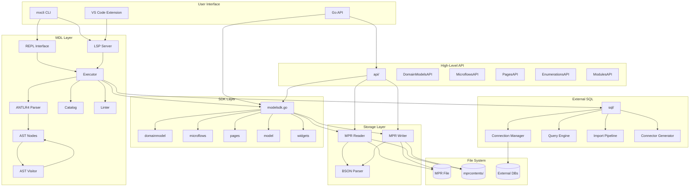

# System Architecture

ModelSDK Go is a Go-native library for reading and modifying Mendix application projects (`.mpr` files). It provides programmatic access to Mendix projects without cloud connectivity, serving as an alternative to the TypeScript-based Mendix Model SDK.

## High-Level Architecture

The system is organized into layered components, from user-facing interfaces down to file system storage:

## Layer Summary

| Layer | Purpose |
|-------|---------|
| **User Interface** | CLI (`mxcli`), Go API, and VS Code extension provide entry points for users and tools |
| **MDL Layer** | SQL-like language parser, executor, REPL, LSP server, catalog, and linter |
| **High-Level API** | Fluent builder API for domain models, microflows, pages, enumerations, and modules |
| **SDK Layer** | Core Go types and operations for Mendix model elements |
| **External SQL** | Database connectivity for PostgreSQL, Oracle, and SQL Server |
| **Storage Layer** | MPR file reading, writing, and BSON parsing |
| **File System** | Physical `.mpr` files, `mprcontents/` directories, and external databases |

## Key Design Decisions

1. **ANTLR4 for Grammar** -- Enables cross-language grammar sharing (Go, TypeScript, Java) with case-insensitive keywords and built-in error recovery.

2. **BSON for Serialization** -- Native Mendix format compatibility using `go.mongodb.org/mongo-driver/bson`, handling polymorphic types via `$Type` fields.

3. **Two-Phase Loading** -- Units are loaded on-demand for performance, with lazy loading of related documents.

4. **Interface-Based Design** -- `Element` and `AttributeType` interfaces enable type-safe polymorphic operations across element types.

5. **Pure Go / No CGO** -- Uses `modernc.org/sqlite` (pure Go SQLite) to eliminate the C compiler dependency, simplifying cross-compilation and deployment.

6. **Widget Template System** -- Pluggable widgets require complex BSON with internal ID references. Embedded JSON templates extracted from Studio Pro are cloned and customized at runtime.

7. **Credential Isolation** -- External database credentials resolve from environment variables or YAML config, never stored in MDL scripts.
