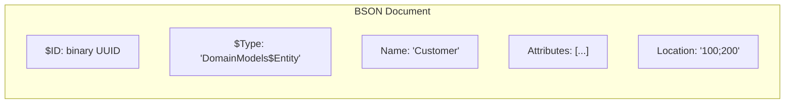

# BSON Document Structure

How Mendix project documents are serialized in BSON format, including the role of `$Type` fields, nested structures, array version markers, and widget serialization.

## Source of Truth

The authoritative reference for BSON serialization is the **reflection-data** at:

```
reference/mendixmodellib/reflection-data/{version}-structures.json
```

Each structure entry contains:
- `qualifiedName`: The API name (e.g., `Pages$DivContainer`)
- `storageName`: The BSON `$Type` value (e.g., `Forms$DivContainer`)
- `defaultSettings`: Required default property values
- `properties`: Property definitions with types and requirements

## Type Name Mapping

Mendix uses different prefixes for API names vs storage names:

| API Prefix | Storage Prefix | Domain |
|------------|----------------|--------|
| `Pages$` | `Forms$` | Page widgets |
| `Microflows$` | `Microflows$` | Microflow elements |
| `DomainModels$` | `DomainModels$` | Domain model elements |
| `Texts$` | `Texts$` | Text/translation elements |
| `DataTypes$` | `DataTypes$` | Data type definitions |
| `CustomWidgets$` | `CustomWidgets$` | Pluggable widgets |

### Common Type Name Mistakes

| Incorrect (will fail) | Correct Storage Name |
|-----------------------|---------------------|
| `Forms$NoClientAction` | `Forms$NoAction` |
| `Forms$PageClientAction` | `Forms$FormAction` |
| `Forms$MicroflowClientAction` | `Forms$MicroflowAction` |
| `Pages$DivContainer` | `Forms$DivContainer` |
| `Pages$ActionButton` | `Forms$ActionButton` |

## Unit Document Structure

Each model element (entity, microflow, page, etc.) is stored as a BSON document:



## Array Version Markers

Mendix BSON uses version markers for arrays:

| Marker | Meaning |
|--------|---------|
| `[3]` | Empty array |
| `[2, item1, item2, ...]` | Non-empty array with items |
| `[3, item1, item2, ...]` | Non-empty array (text items) |

Example:

```json
"Widgets": [3]           // Empty widgets array
"Widgets": [2, {...}]    // One widget
"Items": [3, {...}]      // One text translation item
```

**Important**: These version markers only exist in BSON format, not in JSON templates. In JSON, `[2]` is an array containing the integer 2, not an empty array with a version marker.

## Page Structure

A page document has this top-level structure:

```json
{
  "$ID": "<uuid>",
  "$Type": "Forms$Page",
  "AllowedModuleRoles": [1],
  "Appearance": { ... },
  "Autofocus": "DesktopOnly",
  "CanvasHeight": 600,
  "CanvasWidth": 1200,
  "Documentation": "",
  "Excluded": false,
  "ExportLevel": "Hidden",
  "FormCall": { ... },
  "Name": "PageName",
  "Parameters": [3, ...],
  "PopupCloseAction": "",
  "Title": { ... },
  "Url": "page_url",
  "Variables": [3]
}
```

## Appearance Object

Standard appearance object for widgets:

```json
{
  "$ID": "<uuid>",
  "$Type": "Forms$Appearance",
  "Class": "",
  "DesignProperties": [3],
  "DynamicClasses": "",
  "Style": ""
}
```

## Widget Default Properties

Each widget type requires specific default properties to be serialized. Studio Pro will fail to load the project if required properties are missing.

### DivContainer (Container)

```json
{
  "$Type": "Forms$DivContainer",
  "Appearance": { ... },
  "ConditionalVisibilitySettings": null,
  "Name": "",
  "NativeAccessibilitySettings": null,
  "OnClickAction": { "$Type": "Forms$NoAction", ... },
  "RenderMode": "Div",
  "ScreenReaderHidden": false,
  "TabIndex": 0,
  "Widgets": [3]
}
```

### DataView

```json
{
  "$Type": "Forms$DataView",
  "Appearance": { ... },
  "ConditionalEditabilitySettings": null,
  "ConditionalVisibilitySettings": null,
  "DataSource": { ... },
  "Editability": "Always",
  "FooterWidgets": [3],
  "LabelWidth": 3,
  "Name": "",
  "NoEntityMessage": { ... },
  "ReadOnlyStyle": "Control",
  "ShowFooter": true,
  "TabIndex": 0,
  "Widgets": [3]
}
```

### Input Widgets (TextBox, TextArea, DatePicker, etc.)

Input widgets require several non-null properties:

```json
{
  "$Type": "Forms$TextBox",
  "Appearance": { ... },
  "AriaRequired": false,
  "AttributeRef": {
    "$ID": "<uuid>",
    "$Type": "DomainModels$AttributeRef",
    "Attribute": "Module.Entity.AttributeName",
    "EntityRef": null
  },
  "ConditionalEditabilitySettings": null,
  "ConditionalVisibilitySettings": null,
  "Editable": "Always",
  "FormattingInfo": { ... },
  "IsPasswordBox": false,
  "LabelTemplate": { ... },
  "Name": "textBox1",
  "NativeAccessibilitySettings": null,
  "OnChangeAction": { "$Type": "Forms$NoAction", ... },
  "OnEnterAction": { "$Type": "Forms$NoAction", ... },
  "OnEnterKeyPressAction": { "$Type": "Forms$NoAction", ... },
  "OnLeaveAction": { "$Type": "Forms$NoAction", ... },
  "PlaceholderTemplate": { ... },
  "ReadOnlyStyle": "Inherit",
  "TabIndex": 0,
  "Validation": { ... }
}
```

Required nested objects:
- `AttributeRef` -- Must have `Attribute` as fully qualified path (e.g., `Module.Entity.AttributeName`)
- `FormattingInfo` -- Required for TextBox and DatePicker
- `PlaceholderTemplate` -- Required `Forms$ClientTemplate` object
- `Validation` -- Required `Forms$WidgetValidation` object

### Attribute Path Resolution

The `AttributeRef.Attribute` field requires a **fully qualified path** in the format `Module.Entity.AttributeName`. When using short attribute names in MDL, the SDK automatically resolves them using the DataView's entity context.

## Client Action Types

| Action Type | Storage Name |
|-------------|--------------|
| No Action | `Forms$NoAction` |
| Save Changes | `Forms$SaveChangesClientAction` |
| Cancel Changes | `Forms$CancelChangesClientAction` |
| Close Page | `Forms$ClosePageClientAction` |
| Delete | `Forms$DeleteClientAction` |
| Show Page | `Forms$FormAction` |
| Call Microflow | `Forms$MicroflowAction` |
| Call Nanoflow | `Forms$CallNanoflowClientAction` |

## Pluggable Widgets (CustomWidget)

Pluggable widgets like ComboBox use `CustomWidgets$CustomWidget` with a complex nested structure:

```json
{
  "$Type": "CustomWidgets$CustomWidget",
  "Appearance": { ... },
  "Name": "comboBox1",
  "Object": {
    "$Type": "CustomWidgets$WidgetObject",
    "Properties": [2, { ... }],
    "TypePointer": "<binary ID referencing ObjectType>"
  },
  "Type": {
    "$Type": "CustomWidgets$CustomWidgetType",
    "ObjectType": {
      "$Type": "CustomWidgets$WidgetObjectType",
      "PropertyTypes": [2, { ... }]
    },
    "WidgetId": "com.mendix.widget.web.combobox.Combobox"
  }
}
```

### TypePointer References

There are three levels of TypePointer references:

1. **WidgetObject.TypePointer** references `ObjectType.$ID` (the WidgetObjectType)
2. **WidgetProperty.TypePointer** references `PropertyType.$ID` (the WidgetPropertyType)
3. **WidgetValue.TypePointer** references `ValueType.$ID` (the WidgetValueType)

```
CustomWidgetType
└── ObjectType (WidgetObjectType)           ← WidgetObject.TypePointer
    └── PropertyTypes[]
        └── PropertyType (WidgetPropertyType) ← WidgetProperty.TypePointer
            └── ValueType (WidgetValueType)   ← WidgetValue.TypePointer
```

If any TypePointer is missing or references an invalid ID, Studio Pro will fail to load the widget.

### Widget Size

Each pluggable widget instance contains a **full copy** of both Type and Object:

| Component | BSON Size | Description |
|-----------|-----------|-------------|
| Type (CustomWidgetType) | ~54 KB | Widget definition with all PropertyTypes |
| Object (WidgetObject) | ~34 KB | Property values for all PropertyTypes |
| **Total per widget** | **~88 KB** | |

There is no deduplication within a page. A page with 4 ComboBox widgets requires ~352 KB for widgets alone.

## Common Errors

| Error | Cause | Solution |
|-------|-------|----------|
| "The type cache does not contain a type with qualified name X" | Incorrect `$Type` value | Check reflection-data for correct storage name |
| "No entity configured for the data source" | Missing or incorrect DataView DataSource | Configure `Forms$DataViewSource` with proper EntityRef |
| CE0463 "widget definition has changed" | Object properties don't match Type PropertyTypes | Use template Object as base, only modify needed properties |
| "Project uses features that are no longer supported" | Missing widget default properties | Include all required defaults from reflection-data |

## Files Reference

| File | Purpose |
|------|---------|
| `sdk/mpr/writer_widgets.go` | Widget serialization to BSON |
| `sdk/mpr/writer_pages.go` | Page serialization |
| `sdk/mpr/reader_widgets.go` | Widget template extraction and cloning |
| `sdk/mpr/parser_page.go` | Page deserialization |
| `sdk/widgets/loader.go` | Embedded template loading |
| `sdk/widgets/templates/mendix-11.6/*.json` | Embedded widget templates |
| `reference/mendixmodellib/reflection-data/*.json` | Type definitions |
