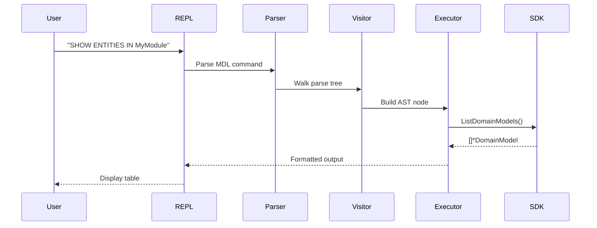
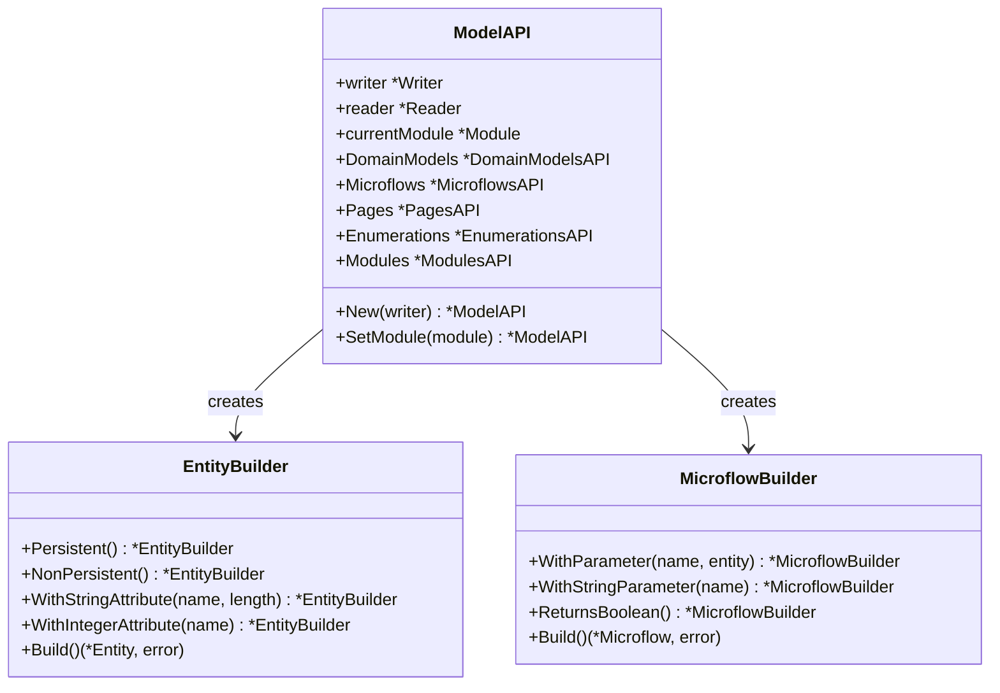
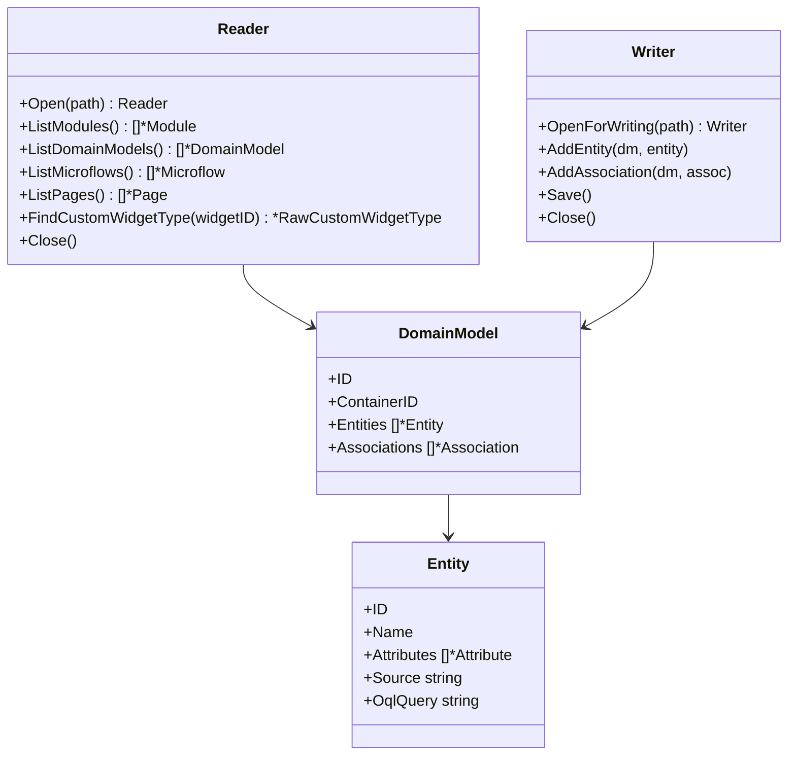
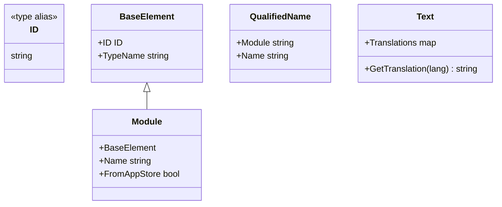
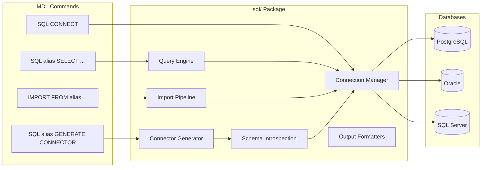
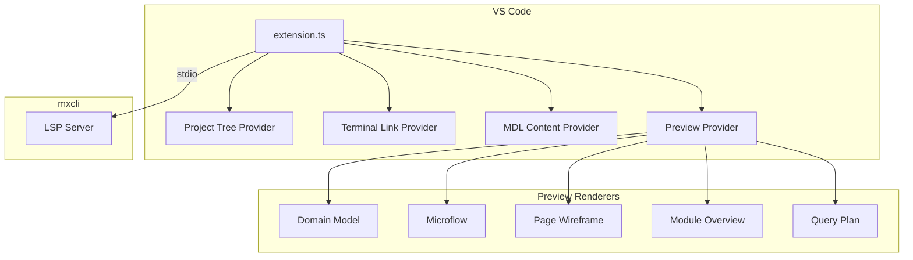

# Layer Diagram

Detailed description of each architectural layer in ModelSDK Go.

## 1. Command Layer (`cmd/`)

| Package | Purpose |
|---------|---------|
| `cmd/mxcli` | CLI entry point using Cobra framework; includes LSP server, Docker integration, diagnostics |
| `cmd/codegen` | Metamodel code generator from reflection data |

Key CLI subcommands:

| Subcommand | File | Purpose |
|------------|------|---------|
| `exec` | `cmd_exec.go` | Execute MDL script files |
| `check` | `cmd_check.go` | Syntax and reference validation |
| `lint` | `cmd_lint.go` | Run linting rules |
| `report` | `cmd_report.go` | Best practices report |
| `test` | `cmd_test_run.go` | Run `.test.mdl` / `.test.md` tests |
| `diff` | `cmd_diff.go` | Compare script against project |
| `sql` | `cmd_sql.go` | External SQL queries |
| `lsp` | `lsp.go` | Language Server Protocol server |
| `init` | `init.go` | Project initialization |
| `docker` | `docker.go` | Docker build/check/OQL integration |
| `diag` | `diag.go` | Session logs, bug report bundles |

## 2. MDL Layer (`mdl/`)

The MDL (Mendix Definition Language) layer provides a SQL-like interface for querying and modifying Mendix models.

| Package | Purpose |
|---------|---------|
| `mdl/grammar` | ANTLR4 lexer/parser (generated from MDLLexer.g4 + MDLParser.g4) |
| `mdl/ast` | AST node types for MDL statements |
| `mdl/visitor` | ANTLR listener that builds AST from parse tree |
| `mdl/executor` | Executes AST nodes against the SDK (~45k lines across 40+ files) |
| `mdl/catalog` | SQLite-based catalog for querying project metadata |
| `mdl/linter` | Extensible linting framework with built-in rules and Starlark scripting |
| `mdl/repl` | Interactive REPL interface |

## 3. High-Level API Layer (`api/`)

The `api/` package provides a simplified, fluent builder API inspired by the Mendix Web Extensibility Model API.

| File | Purpose |
|------|---------|
| `api/api.go` | ModelAPI entry point with namespace access |
| `api/domainmodels.go` | EntityBuilder, AssociationBuilder, AttributeBuilder |
| `api/enumerations.go` | EnumerationBuilder, EnumValueBuilder |
| `api/microflows.go` | MicroflowBuilder with parameters and return types |
| `api/pages.go` | PageBuilder, widget builders |
| `api/modules.go` | ModulesAPI for module retrieval |

## 4. SDK Layer (`sdk/`)

The SDK layer provides Go types and APIs for Mendix model elements.

| Package | Purpose |
|---------|---------|
| `sdk/mpr/` | MPR file format handling (~18k lines across reader, writer, parser files split by domain) |
| `sdk/domainmodel` | Entity, Attribute, Association types |
| `sdk/microflows` | Microflow, Activity types (60+ types) |
| `sdk/pages` | Page, Widget types (50+ types) |
| `sdk/widgets` | Embedded widget templates for pluggable widgets |

The `sdk/mpr/` package is split by domain for maintainability:

| File Pattern | Purpose |
|--------------|---------|
| `reader.go`, `reader_*.go` | Read-only MPR access, split by element type |
| `writer.go`, `writer_*.go` | Read-write MPR modification (domainmodel, microflow, security, widgets, etc.) |
| `parser.go`, `parser_*.go` | BSON parsing and deserialization (domainmodel, microflow, etc.) |
| `utils.go` | UUID generation utilities |

## 5. Model Layer (`model/`)

Core types shared across the SDK:

## 6. External SQL Layer (`sql/`)

The `sql/` package provides external database connectivity for querying PostgreSQL, Oracle, and SQL Server databases.

| File | Purpose |
|------|---------|
| `driver.go` | DriverName type, ParseDriver() |
| `connection.go` | Manager, Connection, credential isolation |
| `config.go` | DSN resolution (env vars, YAML config) |
| `query.go` | Execute() -- query via database/sql |
| `meta.go` | ShowTables(), DescribeTable() via information_schema |
| `import.go` | IMPORT pipeline: batch insert, ID generation, sequence tracking |
| `generate.go` | Database Connector MDL generation from external schema |
| `typemap.go` | SQL to Mendix type mapping, DSN to JDBC URL conversion |
| `mendix.go` | Mendix DB DSN builder, table/column name helpers |
| `format.go` | Table and JSON output formatters |

## 7. VS Code Extension (`vscode-mdl/`)

The VS Code extension provides MDL language support via an LSP client that communicates with `mxcli lsp --stdio`.

LSP features include syntax highlighting, parse/semantic diagnostics, completion, symbols, folding, hover, go-to-definition, clickable terminal links, and context menu commands.

## 8. LSP Server (`cmd/mxcli/lsp*.go`)

The LSP server is embedded in the `mxcli` binary:

| File | Purpose |
|------|---------|
| `lsp.go` | Main LSP server, hover, go-to-definition |
| `lsp_diagnostics.go` | Parse and semantic error reporting |
| `lsp_completion.go` | Context-aware completions |
| `lsp_completions_gen.go` | Generated completion data |
| `lsp_symbols.go` | Document symbols |
| `lsp_folding.go` | Code folding ranges |
| `lsp_hover.go` | Hover information |
| `lsp_helpers.go` | Shared utilities |
