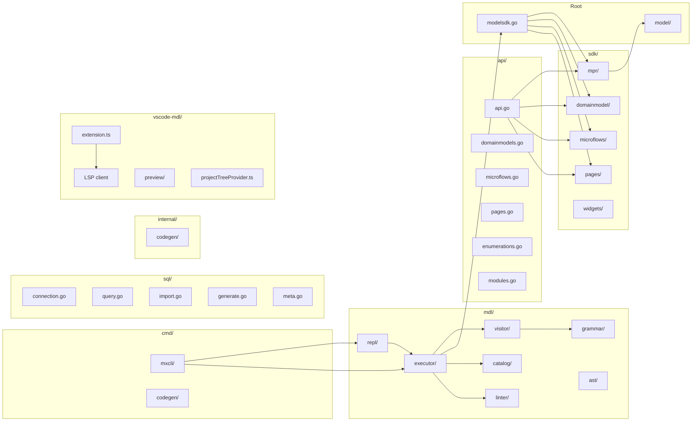

# Package Structure

Overview of the Go package organization and dependency relationships.

## Package Dependency Graph



## Directory Layout

```
github.com/mendixlabs/mxcli/
├── modelsdk.go              # Main public API (Open, OpenForWriting, helpers)
├── model/                   # Core types: ID, QualifiedName, Module, Element interface
│
├── api/                     # High-level fluent API
│   ├── api.go               # ModelAPI entry point with namespace access
│   ├── domainmodels.go      # EntityBuilder, AssociationBuilder, AttributeBuilder
│   ├── enumerations.go      # EnumerationBuilder
│   ├── microflows.go        # MicroflowBuilder
│   ├── pages.go             # PageBuilder, widget builders
│   └── modules.go           # ModulesAPI
│
├── sdk/                     # SDK implementation packages
│   ├── domainmodel/         # Entity, Attribute, Association, DomainModel
│   ├── microflows/          # Microflow, Nanoflow, activities (60+ types)
│   ├── pages/               # Page, Layout, Widget types (50+ widgets)
│   ├── widgets/             # Embedded widget templates for pluggable widgets
│   │   ├── loader.go        # Template loading with go:embed
│   │   └── templates/       # JSON widget type definitions by Mendix version
│   └── mpr/                 # MPR file format handling
│       ├── reader.go        # Read-only MPR access
│       ├── writer.go        # Read-write MPR modification
│       ├── parser.go        # BSON parsing and deserialization
│       └── utils.go         # UUID generation utilities
│
├── mdl/                     # MDL parser & CLI
│   ├── grammar/             # ANTLR4 grammar definition
│   │   ├── MDLLexer.g4      # Lexer grammar (tokens)
│   │   ├── MDLParser.g4     # Parser grammar (rules)
│   │   └── parser/          # Generated Go parser code
│   ├── ast/                 # AST node types for MDL statements
│   ├── visitor/             # ANTLR listener to build AST
│   ├── executor/            # Executes AST against modelsdk-go
│   ├── catalog/             # SQLite-based catalog for querying project metadata
│   ├── linter/              # Extensible linting framework
│   │   └── rules/           # Built-in lint rules
│   └── repl/                # Interactive REPL interface
│
├── sql/                     # External database connectivity
│   ├── driver.go            # DriverName type, ParseDriver()
│   ├── connection.go        # Manager, Connection, credential isolation
│   ├── config.go            # DSN resolution (env vars, YAML config)
│   ├── query.go             # Execute() -- query via database/sql
│   ├── meta.go              # ShowTables(), DescribeTable()
│   ├── format.go            # Table and JSON output formatters
│   ├── mendix.go            # Mendix DB DSN builder, table/column name helpers
│   ├── import.go            # IMPORT pipeline: batch insert, ID generation
│   ├── generate.go          # Database Connector MDL generation
│   └── typemap.go           # SQL to Mendix type mapping
│
├── cmd/                     # Command-line tools
│   ├── mxcli/               # CLI entry point (Cobra-based)
│   └── codegen/             # Code generator CLI
│
├── internal/                # Internal packages (not exported)
│   └── codegen/             # Metamodel code generation system
│       ├── schema/          # JSON reflection data loading
│       ├── transform/       # Transform to Go types
│       └── emit/            # Go source code generation
│
├── generated/metamodel/     # Auto-generated type definitions
├── examples/                # Usage examples
│
├── vscode-mdl/              # VS Code extension (TypeScript, uses bun)
│   ├── src/extension.ts     # Extension entry point
│   └── package.json         # Extension manifest
│
└── reference/               # Reference materials (not Go code)
    ├── mendixmodellib/      # TypeScript library + reflection data
    ├── mendixmodelsdk/      # TypeScript SDK reference
    └── mdl-grammar/         # Comprehensive MDL grammar reference
```

## Key Package Responsibilities

| Package | Exported | Description |
|---------|----------|-------------|
| `modelsdk` (root) | Yes | Main public API: `Open()`, `OpenForWriting()`, helper constructors |
| `model/` | Yes | Core types: `ID`, `QualifiedName`, `Module`, `Element` interface |
| `api/` | Yes | Fluent builder API for domain models, microflows, pages |
| `sdk/domainmodel/` | Yes | Entity, Attribute, Association Go types |
| `sdk/microflows/` | Yes | Microflow, Nanoflow, 60+ activity types |
| `sdk/pages/` | Yes | Page, Layout, 50+ widget types |
| `sdk/widgets/` | Yes | Widget template loading and cloning |
| `sdk/mpr/` | Yes | MPR reader, writer, BSON parser |
| `mdl/grammar/` | Yes | ANTLR4 generated lexer/parser |
| `mdl/ast/` | Yes | AST node types for all MDL statements |
| `mdl/visitor/` | Yes | Parse tree to AST conversion |
| `mdl/executor/` | Yes | AST execution against SDK |
| `mdl/catalog/` | Yes | SQLite metadata catalog |
| `mdl/linter/` | Yes | Linting framework and rules |
| `sql/` | Yes | External database connectivity |
| `internal/codegen/` | No | Metamodel code generation (not exported) |

## Dependencies

| Dependency | Purpose |
|------------|---------|
| `modernc.org/sqlite` | Pure Go SQLite driver (no CGO required) |
| `go.mongodb.org/mongo-driver` | BSON parsing for Mendix document format |
| `github.com/antlr4-go/antlr/v4` | ANTLR4 Go runtime for MDL parser |
| `github.com/spf13/cobra` | CLI framework |
| `github.com/jackc/pgx/v5` | PostgreSQL driver |
| `github.com/sijms/go-ora/v2` | Oracle driver |
| `github.com/microsoft/go-mssqldb` | SQL Server driver |
