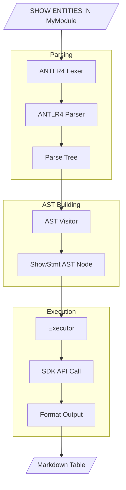

# Lexer - Parser - AST - Executor Pipeline

The complete parsing pipeline from raw MDL text through lexical analysis, parsing, AST construction, and execution against the model.

## Pipeline Flow



## Stage 1: ANTLR4 Grammar

The grammar defines MDL syntax using ANTLR4's EBNF-like notation.

### Case-Insensitive Keywords

Uses fragment rules for case-insensitive matching:

```antlr
// Keywords are case-insensitive
SHOW    : S H O W ;
ENTITY  : E N T I T Y ;

// Fragment rules for each letter
fragment S : [sS] ;
fragment H : [hH] ;
fragment O : [oO] ;
fragment W : [wW] ;
// ... etc
```

This allows `SHOW`, `show`, `Show`, etc. to all match the same token.

### Labeled Alternatives

Parser rules use labeled alternatives for type-safe listener methods:

```antlr
showStatement
    : SHOW MODULES SEMI?                       # ShowModules
    | SHOW ENTITIES (IN IDENTIFIER)? SEMI?     # ShowEntities
    | SHOW ENTITY qualifiedName SEMI?          # ShowEntity
    ;
```

Each label generates a specific listener method (e.g., `EnterShowModules`, `EnterShowEntities`).

### Whitespace Handling

Whitespace is sent to a hidden channel (skipped):

```antlr
WS : [ \t\r\n]+ -> skip ;
```

## Stage 2: Generated Parser

ANTLR4 generates four files from the grammar:

| File | Purpose |
|------|---------|
| `mdl_lexer.go` | Tokenizer -- converts input to token stream |
| `mdl_parser.go` | Parser -- builds parse tree from tokens |
| `mdl_listener.go` | Listener interface -- callbacks for each rule |
| `mdl_base_listener.go` | Empty listener implementation for extension |

## Stage 3: AST Types

Strongly-typed AST nodes representing MDL statements:

```go
// Statement is the interface for all MDL statements
type Statement interface {
    statementNode()
}

// ShowStmt represents SHOW commands
type ShowStmt struct {
    Type   string        // MODULES, ENTITIES, ASSOCIATIONS, ENUMERATIONS
    Module string        // Optional: filter by module
    Name   QualifiedName // For SHOW ENTITY/ASSOCIATION
}

// CreateEntityStmt represents CREATE ENTITY
type CreateEntityStmt struct {
    Name        QualifiedName
    Persistent  bool
    Attributes  []Attribute
    Position    *Position
    Comment     string
    Doc         string
}

// QualifiedName represents Module.Name or just Name
type QualifiedName struct {
    Module string
    Name   string
}
```

## Stage 4: ANTLR Listener (Visitor)

The visitor walks the ANTLR parse tree and builds AST nodes.

### Type Assertions for Context Access

```go
func (v *Visitor) EnterShowEntities(ctx *parser.ShowEntitiesContext) {
    stmt := &ast.ShowStmt{Type: "ENTITIES"}

    // Access IDENTIFIER token if present (IN clause)
    if id := ctx.IDENTIFIER(); id != nil {
        stmt.Module = id.GetText()
    }

    v.program.Statements = append(v.program.Statements, stmt)
}
```

### Building Qualified Names

```go
func buildQualifiedName(ctx parser.IQualifiedNameContext) ast.QualifiedName {
    qn := ctx.(*parser.QualifiedNameContext)
    ids := qn.AllIDENTIFIER()

    if len(ids) == 1 {
        return ast.QualifiedName{Name: ids[0].GetText()}
    }
    return ast.QualifiedName{
        Module: ids[0].GetText(),
        Name:   ids[1].GetText(),
    }
}
```

### Error Handling

Syntax errors are collected via a custom error listener:

```go
type ErrorListener struct {
    *antlr.DefaultErrorListener
    Errors []error
}

func (e *ErrorListener) SyntaxError(recognizer antlr.Recognizer, offendingSymbol interface{},
    line, column int, msg string, ex antlr.RecognitionException) {
    e.Errors = append(e.Errors, fmt.Errorf("line %d:%d %s", line, column, msg))
}
```

## Stage 5: Executor

Executes AST statements against the modelsdk-go API:

```go
type Executor struct {
    writer *mpr.Writer
    output io.Writer
}

func (e *Executor) Execute(stmt ast.Statement) error {
    switch s := stmt.(type) {
    case *ast.ConnectStmt:
        return e.executeConnect(s)
    case *ast.ShowStmt:
        return e.executeShow(s)
    case *ast.CreateEntityStmt:
        return e.executeCreateEntity(s)
    // ... other statement types
    }
}
```

### Integration with SDK

```go
func (e *Executor) executeCreateEntity(stmt *ast.CreateEntityStmt) error {
    // Build domain model entity
    entity := &domainmodel.Entity{
        ID:   mpr.GenerateID(),
        Name: stmt.Name.Name,
        // ... other fields
    }

    // Get module and add entity
    module := e.getOrCreateModule(stmt.Name.Module)
    dm := module.DomainModel
    dm.Entities = append(dm.Entities, entity)

    return nil
}
```

## Stage 6: REPL

Interactive read-eval-print loop ties the pipeline together:

```go
type REPL struct {
    executor *executor.Executor
    input    io.Reader
    output   io.Writer
}

func (r *REPL) Run() error {
    scanner := bufio.NewScanner(r.input)
    for {
        fmt.Fprint(r.output, "mdl> ")
        if !scanner.Scan() {
            break
        }

        input := scanner.Text()
        prog, errs := visitor.Build(input)
        if len(errs) > 0 {
            // Handle parse errors
            continue
        }

        for _, stmt := range prog.Statements {
            if err := r.executor.Execute(stmt); err != nil {
                fmt.Fprintf(r.output, "Error: %v\n", err)
            }
        }
    }
    return nil
}
```

## Extending the Parser

### Adding a New Statement Type

1. **Update grammar** (`MDLLexer.g4` for tokens, `MDLParser.g4` for rules):

```antlr
ddlStatement
    : createStatement
    | newStatement      // Add new statement
    ;

newStatement
    : NEW KEYWORD qualifiedName SEMI?    # NewKeyword
    ;

NEW : N E W ;
KEYWORD : K E Y W O R D ;
```

2. **Regenerate parser**:

```bash
make grammar
```

3. **Add AST type** (`ast/ast.go`):

```go
type NewKeywordStmt struct {
    Name QualifiedName
}

func (*NewKeywordStmt) statementNode() {}
```

4. **Update visitor** (`visitor/visitor.go`):

```go
func (v *Visitor) EnterNewKeyword(ctx *parser.NewKeywordContext) {
    stmt := &ast.NewKeywordStmt{
        Name: buildQualifiedName(ctx.QualifiedName()),
    }
    v.program.Statements = append(v.program.Statements, stmt)
}
```

5. **Update executor** (`executor/executor.go`):

```go
func (e *Executor) Execute(stmt ast.Statement) error {
    switch s := stmt.(type) {
    // ... existing cases
    case *ast.NewKeywordStmt:
        return e.executeNewKeyword(s)
    }
}
```

## Microflow Validation

Before execution, `mxcli check` runs AST-level semantic checks on microflow bodies via `ValidateMicroflow()`. These checks operate purely on the parsed AST and require no project connection:

1. **Return value consistency** -- RETURN must provide a value when the microflow declares a return type
2. **Return type plausibility** -- Scalar literals cannot be returned from entity-typed microflows
3. **Return path coverage** -- All code paths must end with RETURN for non-void microflows
4. **Variable scope** -- Variables declared inside IF/ELSE branches cannot be referenced after the branch ends
5. **Validation feedback** -- VALIDATION FEEDBACK must have a non-empty message template

## Handling Nil Values from ANTLR

ANTLR parsers can return partial parse trees with `nil` nodes when there are syntax errors. Always check if grammar element getters return `nil` before calling methods on them:

```go
// DANGEROUS - will panic if AttributeName() returns nil
attr.Name = a.AttributeName().GetText()

// SAFE - check for nil first
if a.AttributeName() == nil {
    b.addErrorWithExample(
        "Invalid attribute: each attribute must have a name and type",
        `  CREATE PERSISTENT ENTITY MyModule.Customer (
    Name: String(100) NOT NULL,
    Email: String(200),
    Age: Integer
  );`)
    continue
}
attr.Name = a.AttributeName().GetText()
```

Common ANTLR context methods that can return `nil` on parse errors:
- `AttributeName()` -- missing attribute identifier
- `EnumValueName()` -- missing enumeration value identifier
- `QualifiedName()` -- missing or malformed qualified name
- `DataType()` -- missing type specification
- `Expression()` -- missing or malformed expression
