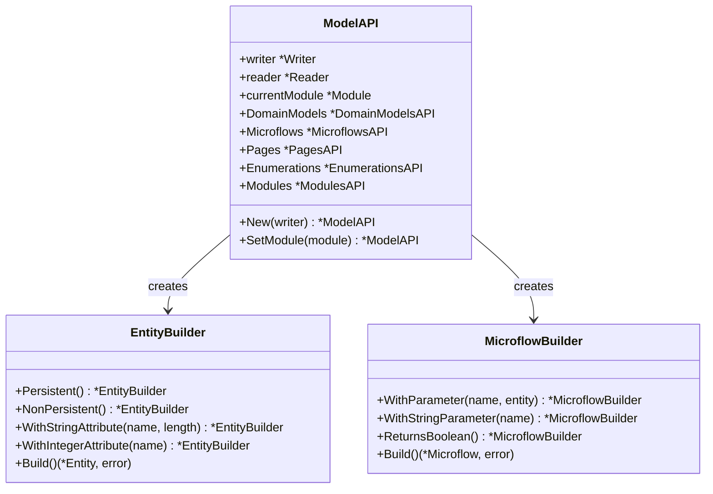

# Fluent API

The `api/` package provides a high-level, fluent builder API inspired by the Mendix Web Extensibility Model API. It simplifies common operations with method chaining and sensible defaults.

## Setup

```go
package main

import (
    "github.com/mendixlabs/mxcli/api"
    "github.com/mendixlabs/mxcli/sdk/mpr"
)

func main() {
    writer, err := mpr.OpenForWriting("/path/to/MyApp.mpr")
    if err != nil {
        panic(err)
    }
    defer writer.Close()

    // Create the high-level API
    modelAPI := api.New(writer)

    // Set the current module context
    module, _ := modelAPI.Modules.GetModule("MyModule")
    modelAPI.SetModule(module)
}
```

## API Structure



## Namespaces

| Namespace | Description |
|-----------|-------------|
| `modelAPI.DomainModels` | Create/modify entities, attributes, associations |
| `modelAPI.Enumerations` | Create/modify enumerations and values |
| `modelAPI.Microflows` | Create microflows with parameters and return types |
| `modelAPI.Pages` | Create pages with widgets (DataView, TextBox, etc.) |
| `modelAPI.Modules` | List and retrieve modules |

## Creating Entities

```go
// Create entity with fluent builder
customer, err := modelAPI.DomainModels.CreateEntity("Customer").
    Persistent().
    WithStringAttribute("Name", 100).
    WithStringAttribute("Email", 254).
    WithIntegerAttribute("Age").
    WithBooleanAttribute("IsActive").
    WithDateTimeAttribute("CreatedDate", true).
    Build()
```

## Creating Associations

```go
_, err := modelAPI.DomainModels.CreateAssociation("Customer_Orders").
    From("Customer").
    To("Order").
    OneToMany().
    Build()
```

## Creating Enumerations

```go
_, err := modelAPI.Enumerations.CreateEnumeration("OrderStatus").
    WithValue("Pending", "Pending").
    WithValue("Processing", "Processing").
    WithValue("Completed", "Completed").
    WithValue("Cancelled", "Cancelled").
    Build()
```

## Creating Microflows

```go
_, err := modelAPI.Microflows.CreateMicroflow("ACT_ProcessOrder").
    WithParameter("Order", "MyModule.Order").
    WithStringParameter("Message").
    ReturnsBoolean().
    Build()
```

## Complete Example

```go
package main

import (
    "github.com/mendixlabs/mxcli/api"
    "github.com/mendixlabs/mxcli/sdk/mpr"
)

func main() {
    writer, err := mpr.OpenForWriting("/path/to/MyApp.mpr")
    if err != nil {
        panic(err)
    }
    defer writer.Close()

    modelAPI := api.New(writer)

    module, _ := modelAPI.Modules.GetModule("MyModule")
    modelAPI.SetModule(module)

    // Create entity with fluent builder
    customer, _ := modelAPI.DomainModels.CreateEntity("Customer").
        Persistent().
        WithStringAttribute("Name", 100).
        WithStringAttribute("Email", 254).
        WithIntegerAttribute("Age").
        WithBooleanAttribute("IsActive").
        WithDateTimeAttribute("CreatedDate", true).
        Build()

    // Create another entity
    order, _ := modelAPI.DomainModels.CreateEntity("Order").
        Persistent().
        WithDecimalAttribute("TotalAmount").
        WithDateTimeAttribute("OrderDate", true).
        Build()

    // Create association between entities
    _, _ = modelAPI.DomainModels.CreateAssociation("Customer_Orders").
        From("Customer").
        To("Order").
        OneToMany().
        Build()

    // Create enumeration
    _, _ = modelAPI.Enumerations.CreateEnumeration("OrderStatus").
        WithValue("Pending", "Pending").
        WithValue("Processing", "Processing").
        WithValue("Completed", "Completed").
        WithValue("Cancelled", "Cancelled").
        Build()

    // Create microflow
    _, _ = modelAPI.Microflows.CreateMicroflow("ACT_ProcessOrder").
        WithParameter("Order", "MyModule.Order").
        WithStringParameter("Message").
        ReturnsBoolean().
        Build()
}
```

## Package Files

| File | Purpose |
|------|---------|
| `api/api.go` | ModelAPI entry point with namespace access |
| `api/domainmodels.go` | EntityBuilder, AssociationBuilder, AttributeBuilder |
| `api/enumerations.go` | EnumerationBuilder, EnumValueBuilder |
| `api/microflows.go` | MicroflowBuilder with parameters and return types |
| `api/pages.go` | PageBuilder, widget builders |
| `api/modules.go` | ModulesAPI for module retrieval |
