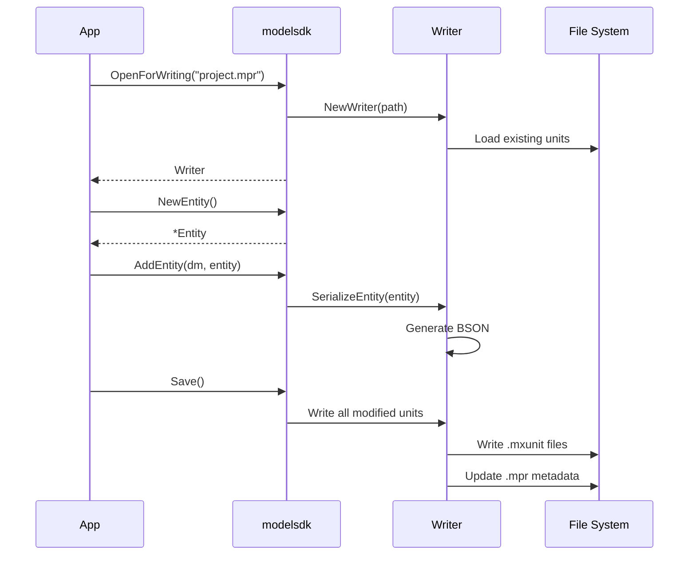

# Modifying a Project

Make changes to a Mendix project file using the writer API. Always back up your `.mpr` file before modifying it.

## Opening for Writing

```go
writer, err := modelsdk.OpenForWriting("/path/to/MyApp.mpr")
if err != nil {
    panic(err)
}
defer writer.Close()
```

The writer provides access to the underlying reader via `writer.Reader()`.

## Complete Example

```go
package main

import (
    "github.com/mendixlabs/mxcli"
)

func main() {
    // Open for writing
    writer, err := modelsdk.OpenForWriting("/path/to/MyApp.mpr")
    if err != nil {
        panic(err)
    }
    defer writer.Close()

    reader := writer.Reader()
    modules, _ := reader.ListModules()
    dm, _ := reader.GetDomainModel(modules[0].ID)

    // Create a new entity
    customer := modelsdk.NewEntity("Customer")
    writer.CreateEntity(dm.ID, customer)

    // Add attributes
    writer.AddAttribute(dm.ID, customer.ID, modelsdk.NewStringAttribute("Name", 200))
    writer.AddAttribute(dm.ID, customer.ID, modelsdk.NewStringAttribute("Email", 254))
    writer.AddAttribute(dm.ID, customer.ID, modelsdk.NewBooleanAttribute("IsActive"))
    writer.AddAttribute(dm.ID, customer.ID, modelsdk.NewDateTimeAttribute("CreatedDate", true))

    // Create another entity
    order := modelsdk.NewEntity("Order")
    writer.CreateEntity(dm.ID, order)

    // Create an association
    assoc := modelsdk.NewAssociation("Customer_Order", customer.ID, order.ID)
    writer.CreateAssociation(dm.ID, assoc)
}
```

## Writer Methods

### Modules

```go
writer.CreateModule(module)
writer.UpdateModule(module)
writer.DeleteModule(id)
```

### Entities

```go
writer.CreateEntity(domainModelID, entity)
writer.UpdateEntity(domainModelID, entity)
writer.DeleteEntity(domainModelID, entityID)
```

### Attributes

```go
writer.AddAttribute(domainModelID, entityID, attribute)
```

### Associations

```go
writer.CreateAssociation(domainModelID, association)
writer.DeleteAssociation(domainModelID, associationID)
```

### Microflows and Nanoflows

```go
writer.CreateMicroflow(microflow)
writer.UpdateMicroflow(microflow)
writer.DeleteMicroflow(id)
writer.CreateNanoflow(nanoflow)
writer.UpdateNanoflow(nanoflow)
writer.DeleteNanoflow(id)
```

### Pages and Layouts

```go
writer.CreatePage(page)
writer.UpdatePage(page)
writer.DeletePage(id)
writer.CreateLayout(layout)
writer.UpdateLayout(layout)
writer.DeleteLayout(id)
```

### Other

```go
writer.CreateEnumeration(enumeration)
writer.CreateConstant(constant)
```

## Helper Functions

```go
// Create attributes
modelsdk.NewStringAttribute(name, length)
modelsdk.NewIntegerAttribute(name)
modelsdk.NewDecimalAttribute(name)
modelsdk.NewBooleanAttribute(name)
modelsdk.NewDateTimeAttribute(name, localize)
modelsdk.NewEnumerationAttribute(name, enumID)

// Create entities
modelsdk.NewEntity(name)                 // Persistable entity
modelsdk.NewNonPersistableEntity(name)   // Non-persistable entity

// Create associations
modelsdk.NewAssociation(name, parentID, childID)      // Reference (1:N)
modelsdk.NewReferenceSetAssociation(name, p, c)       // Reference set (M:N)

// Create flows
modelsdk.NewMicroflow(name)
modelsdk.NewNanoflow(name)

// Create pages
modelsdk.NewPage(name)

// Generate IDs
modelsdk.GenerateID()
```

## Data Flow



## Running the Example

```bash
cd examples/modify_project
go run main.go /path/to/MyApp.mpr
```

**Warning**: Always backup your `.mpr` file before modifying it.
