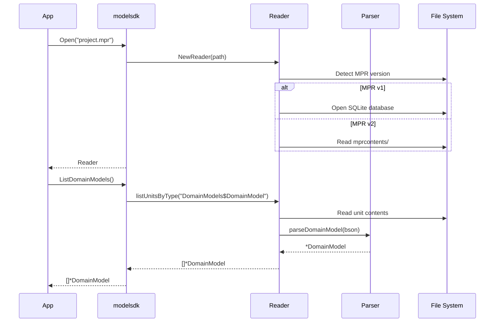

# Reading a Project

Open a Mendix project file (`.mpr`) in read-only mode to inspect its structure and contents.

## Opening a Project

```go
reader, err := modelsdk.Open("/path/to/MyApp.mpr")
if err != nil {
    panic(err)
}
defer reader.Close()
```

The library automatically detects the MPR format version (v1 or v2) and handles both transparently.

## Complete Example

```go
package main

import (
    "fmt"
    "github.com/mendixlabs/mxcli"
)

func main() {
    // Open a Mendix project
    reader, err := modelsdk.Open("/path/to/MyApp.mpr")
    if err != nil {
        panic(err)
    }
    defer reader.Close()

    // List all modules
    modules, _ := reader.ListModules()
    for _, m := range modules {
        fmt.Printf("Module: %s\n", m.Name)
    }

    // Get domain model for a module
    dm, _ := reader.GetDomainModel(modules[0].ID)
    for _, entity := range dm.Entities {
        fmt.Printf("  Entity: %s\n", entity.Name)
        for _, attr := range entity.Attributes {
            fmt.Printf("    - %s: %s\n", attr.Name, attr.Type.GetTypeName())
        }
    }

    // List microflows
    microflows, _ := reader.ListMicroflows()
    fmt.Printf("Total microflows: %d\n", len(microflows))

    // List pages
    pages, _ := reader.ListPages()
    fmt.Printf("Total pages: %d\n", len(pages))
}
```

## Reader Methods

### Metadata

```go
reader.Path()                    // Get file path
reader.Version()                 // Get MPR version (1 or 2)
reader.GetMendixVersion()        // Get Mendix Studio Pro version
```

### Modules

```go
reader.ListModules()             // List all modules
reader.GetModule(id)             // Get module by ID
reader.GetModuleByName(name)     // Get module by name
```

### Domain Models

```go
reader.ListDomainModels()        // List all domain models
reader.GetDomainModel(moduleID)  // Get domain model for module
```

### Microflows and Nanoflows

```go
reader.ListMicroflows()          // List all microflows
reader.GetMicroflow(id)          // Get microflow by ID
reader.ListNanoflows()           // List all nanoflows
reader.GetNanoflow(id)           // Get nanoflow by ID
```

### Pages and Layouts

```go
reader.ListPages()               // List all pages
reader.GetPage(id)               // Get page by ID
reader.ListLayouts()             // List all layouts
reader.GetLayout(id)             // Get layout by ID
```

### Other Elements

```go
reader.ListEnumerations()        // List all enumerations
reader.ListConstants()           // List all constants
reader.ListScheduledEvents()     // List all scheduled events
reader.ExportJSON()              // Export entire model as JSON
```

## Running the Example

```bash
cd examples/read_project
go run main.go /path/to/MyApp.mpr
```

## Data Flow



Units are loaded on-demand for performance. The reader uses lazy loading so that related documents are only parsed when accessed.
