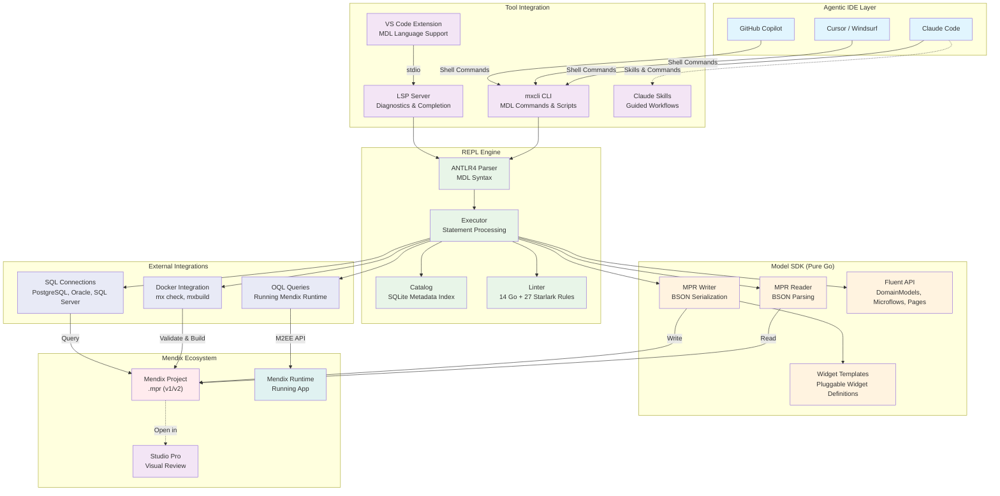
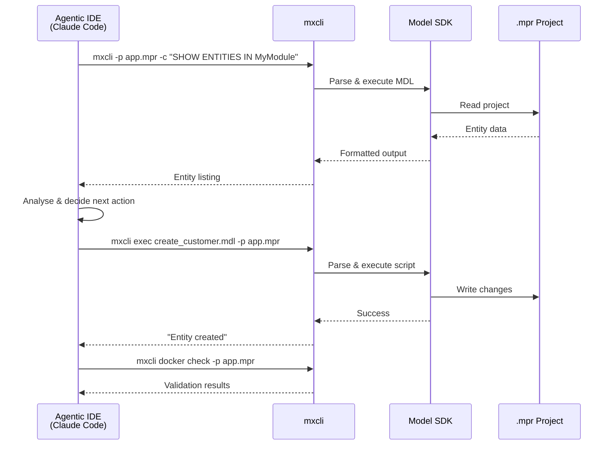
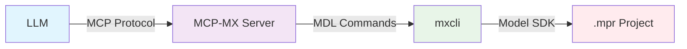
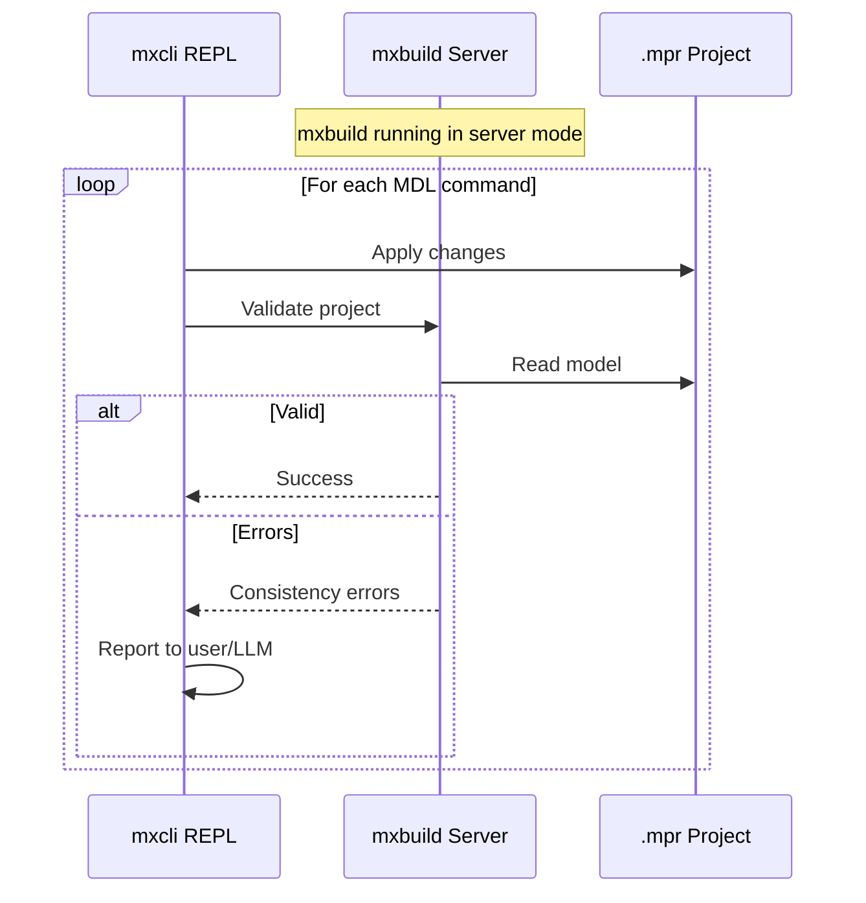
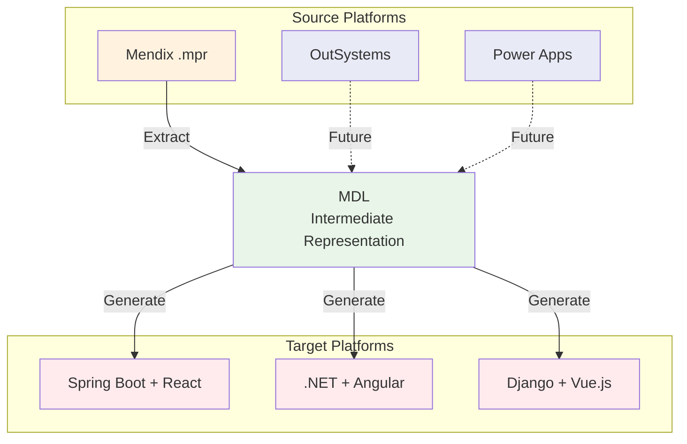
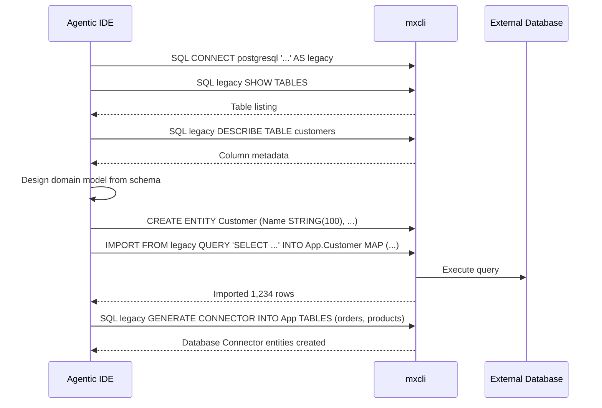

# Project Vision: ModelSDK Go & MDL

## Executive Summary

ModelSDK Go provides a Go-native library and CLI (`mxcli`) for reading and modifying Mendix application projects (`.mpr` files) stored locally on disk. Combined with MDL (Mendix Definition Language) — a SQL-like DSL for Mendix model operations — it enables AI-assisted development, migration, and maintenance of Mendix applications through agentic IDEs such as Claude Code, Cursor, and Windsurf.

> **See also**: [Mendix for Agentic IDEs: Vision & Architecture](../01-project/mendix-agentic-ide-vision.md) for the broader strategic vision.

## Architecture Overview

The architecture centres on `mxcli` as the CLI tool that agentic IDEs invoke directly. The REPL/executor parses MDL commands and manipulates Mendix projects through a pure-Go Model SDK that reads and writes `.mpr` files on disk. An LSP server and VS Code extension provide real-time language support.



### Key Components

1. **mxcli CLI**: Entry point for all MDL operations — interactive REPL, script execution, linting, testing, reporting, and project initialisation
2. **ANTLR4 Parser**: Full MDL grammar with syntax and semantic validation
3. **Executor**: Processes parsed MDL statements against the Model SDK
4. **Model SDK**: Pure-Go library for reading and writing `.mpr` files (v1 and v2 formats) via BSON parsing/serialisation
5. **Fluent API**: High-level builders for domain models, microflows, pages, enumerations, and modules
6. **Catalog**: SQLite-based metadata index enabling SQL queries over project structure
7. **LSP Server**: Language Server Protocol implementation with diagnostics, completion, hover, go-to-definition, symbols, and folding
8. **VS Code Extension**: MDL syntax highlighting, parse/semantic diagnostics, and context menu commands
9. **Linter**: Extensible framework with 14 built-in Go rules and 27 Starlark rules across MDL, SEC, QUAL, ARCH, DESIGN, and CONV categories
10. **Docker Integration**: `mx check` validation and `mxbuild` compilation via Docker

### Current Capabilities

| Category | Features |
|----------|----------|
| **Domain Model** | CREATE, ALTER, DROP, DESCRIBE, SHOW for entities, attributes, associations, enumerations, constants |
| **Microflows** | CREATE, ALTER, DROP, DESCRIBE, SHOW with 60+ activity types |
| **Pages** | CREATE, ALTER PAGE/SNIPPET (SET, INSERT, DROP, REPLACE) with 50+ widget types |
| **Security** | Module roles, user roles, demo users, GRANT/REVOKE, entity/microflow/page access rules |
| **Navigation** | Profiles, home pages, menus, login pages |
| **Business Events** | SHOW, DESCRIBE, CREATE, DROP |
| **Settings** | SHOW, DESCRIBE, ALTER project settings |
| **Code Navigation** | SHOW CALLERS, CALLEES, REFERENCES, IMPACT, CONTEXT OF |
| **Full-text Search** | SEARCH across all strings and source |
| **Catalog Queries** | SQL queries over project metadata via CATALOG tables |
| **External SQL** | Connect and query PostgreSQL, Oracle, SQL Server |
| **Data Import** | IMPORT from external databases with batch insert and ID generation |
| **Connector Gen** | Auto-generate Database Connector MDL from external schema |
| **OQL** | Execute OQL queries against running Mendix runtime |
| **Testing** | `.test.mdl` / `.test.md` test files with Docker-based execution |
| **Linting** | 41 rules with JSON/SARIF output |
| **Reporting** | Scored best practices report with category breakdown |
| **Diff** | Compare MDL scripts against project state; git diff for MPR v2 |

### How Agentic IDEs Use mxcli

The primary integration pattern is direct CLI invocation. Agentic IDEs call `mxcli` commands and read the output:



Skills (`.claude/skills/`) guide the AI through complex workflows like creating CRUD pages, writing microflows, or managing security — providing syntax references and validation checklists that prevent common mistakes.

## Future Vision

### 1. MCP Server Integration

Wrap `mxcli` capabilities as an MCP (Model Context Protocol) server, enabling structured tool-use integration with LLMs beyond simple CLI invocation:



**Benefits**:
- Structured tool definitions with typed parameters
- Better error handling and result formatting
- Protocol-level integration with any MCP-compatible client

### 2. Studio Pro Live Integration

Enable real-time collaboration between agentic IDEs and Studio Pro through a Studio Pro extension:

- Live model synchronisation — changes made via MDL appear instantly in Studio Pro
- Visual feedback loop — developers see AI-generated changes in the visual editor
- Conflict resolution when both human and AI edit simultaneously

### 3. Continuous Validation Pipeline

Integrate `mxbuild` in server mode for real-time validation after every model change:



**Current state**: `mx check` available via Docker for batch validation. Server mode would enable sub-second incremental validation.

### 4. Extended Metamodel Coverage

Currently 4 of 52 metamodel domains are fully implemented. Priority domains for expansion:

| Domain | Use Case |
|--------|----------|
| Workflows | Business process automation |
| REST Publishing | API-first development |
| Scheduled Events | Background processing |
| Web Services | Enterprise integration |
| Document Templates | Report generation |

### 5. Cross-Platform Migration

Use MDL as an intermediate representation for migrating between platforms:



## Strategic Applications

### 1. Database-First Application Generation

Already partially implemented via external SQL connectivity and IMPORT pipeline:



### 2. AI-Assisted Code Review

The linting and reporting framework enables automated quality assessment:

```bash
# Lint with SARIF output for IDE integration
mxcli lint -p app.mpr --format sarif

# Generate scored best practices report
mxcli report -p app.mpr --format markdown

# Analyse impact of changes
mxcli -p app.mpr -c "SHOW IMPACT OF MyModule.CustomerMicroflow"
```

### 3. Version Migration Assistant

Use MDL analysis and the linter framework to detect and fix compatibility issues during Mendix platform upgrades.

## Risk Analysis and Mitigation

### Technical Risks

1. **MPR Format Changes**:
   - **Risk**: Mendix may change the `.mpr` file format in future versions
   - **Mitigation**: Support both v1 (single file) and v2 (folder-based) formats; format detection is automatic
   - **Strategy**: Maintain compatibility tests against multiple Mendix versions

2. **Metamodel Coverage Gaps**:
   - **Risk**: 48 of 52 domains not yet implemented limits scope
   - **Mitigation**: Prioritise domains by user demand; code generator accelerates new domain support
   - **Strategy**: Focus on the 4 core domains (domain model, microflows, pages, security) that cover 80%+ of use cases

3. **Widget Template Maintenance**:
   - **Risk**: Pluggable widget templates must match Studio Pro expectations exactly
   - **Mitigation**: Extract templates from Studio Pro-created widgets; CE0463 debugging workflow documented
   - **Strategy**: Community contribution of templates for popular marketplace widgets

### Business Opportunities

1. **Agentic IDE Platform**: Position Mendix as the safest target for AI-generated enterprise applications
2. **Enterprise Migration Services**: Automated legacy system modernisation via database-first generation
3. **Developer Productivity**: MDL scripts as reusable, version-controlled development accelerators
4. **Quality Assurance**: Automated linting and reporting as part of CI/CD pipelines

## Conclusion

ModelSDK Go and MDL provide a practical, working toolchain for AI-assisted Mendix development. The CLI-first architecture integrates naturally with agentic IDEs — no protocol translation layer required. The combination of a pure-Go Model SDK, comprehensive MDL syntax, and rich tooling (LSP, linting, testing, reporting) delivers immediate value whilst providing a foundation for future enhancements like MCP server integration, Studio Pro live sync, and cross-platform migration.

---

*This document represents the project vision for ModelSDK Go. For the broader strategic vision on Mendix and agentic IDEs, see [mendix-agentic-ide-vision.md](../01-project/mendix-agentic-ide-vision.md). Technical details are in CLAUDE.md and the docs/ directory.*
